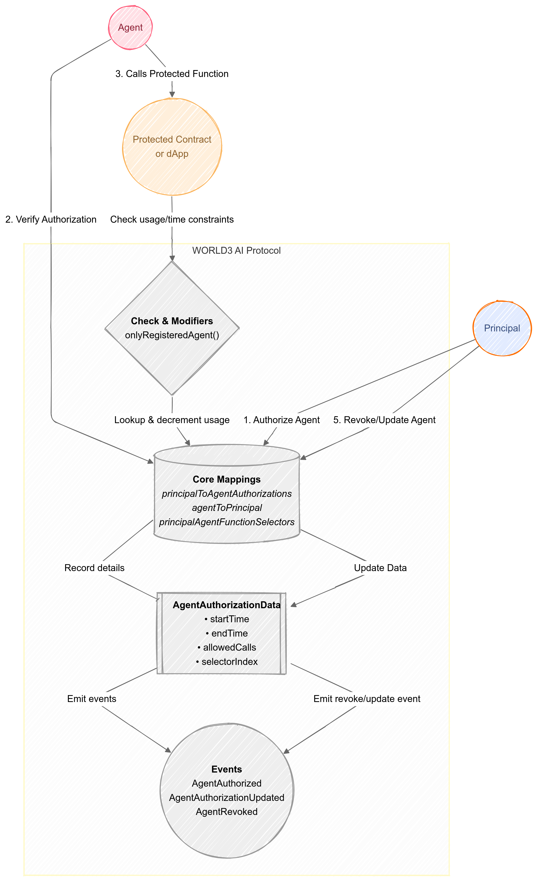

# WORLD3's AI Protocol – Core Design

A flexible on-chain delegation framework that allows **principals** to securely and granularly authorize **agents** (e.g., AI agents or service accounts) to perform specific actions on their behalf—on **any** blockchain platform.

---

## Table of Contents
1. [Overview](#overview)  
2. [Key Features](#key-features)  
3. [High-Level Workflow](#high-level-workflow)  
4. [Protocol Architecture](#protocol-architecture)  
5. [Compare to Account Abstraction (AA)](#compare-to-account-abstraction-aa)  
6. [Future Roadmap](#future-roadmap)  
7. [Conclusion](#conclusion)

---

## Overview
Many decentralized applications (**dApps**) require that users (the **principals**) delegate specific tasks—such as in-game actions, yield-farming steps, or routine administrative functions—to external **agents**. The **WORLD3's AI Protocol** manages this delegation securely by:

- Restricting **agent** permissions to specific function selectors  
- Defining **time-bound** and usage-limited delegations  
- Requiring **agent** consent via a signature  
- Allowing **principals** to revoke delegated permissions at any time  

By incorporating **granular authorization**, the protocol keeps user assets and game states secure while enabling AI-driven or automated account interactions.

---

## Key Features

1. **Function-Level Permissions**  
   - Grant or revoke access per function selector.  
   - Each **agent** can be authorized for multiple function signatures, tracked in an array.

2. **Single Principal per Agent**  
   - Each **agent** can be tied to exactly one **principal** at a time.  
   - If an **agent** is already bound to a different **principal**, the new authorization will be rejected.

3. **Time-Bound Access**  
   - Authorizations can have start/end timestamps.  
   - If either value is zero, it means "no restriction" on that boundary.

4. **Usage Allowance**  
   - Limits how many times an **agent** can invoke an authorized function.  
   - Decrements automatically on each call.

5. **Automatic De-Authorization**  
   - When `allowedCalls` reaches zero, that specific function authorization is removed.  
   - If no authorized functions remain for an **agent**, the **agent**→**principal** association is cleared.

6. **Easy Revocation & Updates**  
   - **Principals** can revoke an **agent**'s authorization for a function at any time.  
   - Partial updates (e.g., adjusting usage limits or time bounds) are possible without re-authorizing from scratch.

7. **Agent Consent via Signature**  
   - The protocol requires a valid **agent** signature for authorization, ensuring **agent** awareness and consent.

8. **Batch Authorizations**  
   - Multiple authorizations can be created or updated in a single transaction, enhancing efficiency for large-scale changes.

9. **Chain-Agnostic**  
   - While the reference is in Solidity (EVM), the core logic can be adapted to Solana, Sui, NEAR, etc.

10. **Event Logging**  
    - `AgentAuthorized`, `AgentAuthorizationUpdated`, and `AgentRevoked` provide real-time auditing of all changes.

---

## High-Level Workflow

1. **Principal Authorizes Agent**  
   - **Principal** calls the authorization function, passing:  
     - The **agent** address  
     - The target **function selector** (e.g., `keccak256("myFunction(uint,uint)")`)  
     - **Time bounds** (`_startTime`, `_endTime`)  
     - **Usage allowance** (`_allowedCalls`)  
     - The **agent**'s **signature** for consent

2. **Data Recorded**  
   - An `AgentAuthorizationData` struct is stored for `(principal, agent, functionSelector)`.  
   - If the **agent** is unassigned, `agentToPrincipal[agent] = principal`.

3. **Agent Calls a Protected Function**  
   - A modifier checks that:  
     - **Agent** is registered with **principal**  
     - Current time is within `[startTime, endTime]`  
     - `allowedCalls` > 0  
   - If valid, the call proceeds; otherwise, it reverts with an error.

4. **Automatic Usage Decrement**  
   - Each successful call decrements `allowedCalls`.  
   - If `allowedCalls` becomes 0, that function's authorization is automatically removed.

5. **Revocation / Removal**  
   - **Principal** can revoke authorization for a given function at any time.  
   - If no functions remain for the **agent**, the protocol clears the **agent**→**principal** link.

6. **Updates**  
   - **Principal** can update start/end times or `allowedCalls` without removing the **agent**.  
   - An **AgentAuthorizationUpdated** event is emitted.

7. **Batch Operations**  
   - A single transaction can create or update multiple authorizations via `batchAuthorizeAgent`.

---

## Protocol Architecture

TThe generic architecture can be summarized as follows:

    

### Core Mappings & Structs

- **`principalToAgentAuthorizations[principal][agent][functionSelector]`**  
  Stores `AgentAuthorizationData` (includes `startTime`, `endTime`, `allowedCalls`, etc.).

- **`agentToPrincipal[agent]`**  
  Maps an **agent** to its **principal**. One **agent** can only have one **principal**.

- **`principalAgentFunctionSelectors[principal][agent]`**  
  An array of function selectors that the **agent** is authorized to call for a specific **principal**.

- **`AgentAuthorizationData`**  
  - **`startTime`**: Timestamp from which the **agent** can invoke the function.  
  - **`endTime`**: Timestamp after which the **agent** can no longer invoke the function.  
  - **`allowedCalls`**: How many times the **agent** can invoke the function.  
  - **`selectorIndex`**: Internal index for quick array management.

- **`BatchAuthorization`**  
  - Used for batch authorizations.  
  - Combines the authorization parameters with the **agent**'s **signature**.

### Authorization Lifecycle

1. **Creation**  
   - **Principal** authorizes **agent**, verifying **agent** signature.  
   - `allowedCalls > 0` → an active authorization is recorded.

2. **Check on Invocation**  
   - `onlyRegisteredAgent(_functionSelector)` ensures the call meets all time/usage constraints.

3. **Usage Depletion**  
   - Each invocation decrements `allowedCalls`.  
   - If `allowedCalls = 0`, the function authorization is removed.

4. **Revocation**  
   - **Principal** can revoke an authorization for any function.  
   - If this was the last function for the **agent**, the **agent**→**principal** link is cleared.

5. **Updates**  
   - **Principal** can update `startTime`, `endTime`, or `allowedCalls` on existing authorizations.

6. **Batch Updates**  
   - Multiple updates can be packaged into one transaction for efficiency.

---

## Compare to Account Abstraction (AA)

1. **Similarity to AA**  
   - The **WORLD3's AI Protocol** abstracts away frequent user signatures, empowering an **agent** to act on behalf of the **principal** within strict boundaries.

2. **Delegate Permissions vs. Private Keys**  
   - Traditional **AA** often relies on a contract-based user wallet.  
   - **WORLD3** delegates only limited authority to an **agent**, guarded by time bounds, usage limits, and the **agent**'s own consent.

3. **Can Be Used in Conjunction**  
   - The **agent** itself can be an **AA**-style account, benefiting from advanced signing or gas management features.

4. **Ideal for AI Automation**  
   - Perfect for letting an AI handle repeated tasks while the **principal** retains final control.

---
## Implementations

### EVM (Ethereum Virtual Machine)
For detailed implementation instructions and code examples, please refer to the [EVM Implementation Guide](./contracts/evm/README.md).

### Move (SUI) Implementation
The World3 AI Protocol has been implemented for the Sui blockchain using Move. This implementation leverages Sui's unique features including:

- Object-centric architecture with distinct UIDs
- Shared object model for concurrent access
- Table-based storage for efficient lookups
- Granular concurrency for parallel transactions
- Move's strong type system for security guarantees
- Per-module registry isolation

For a complete guide to the Sui implementation, see the [Sui Implementation README](contracts/move/sui/README.md) which includes detailed module documentation, usage examples, and a comparison with the EVM version.

---

## Future Roadmap

1. **Role-Based Permissions**  
   - Combine multiple function selectors into a named "role" (e.g., "WorkerRole") for simpler bulk authorizations.

3. **Gasless Meta-Transactions**  
   - Implement relayers so **agents** can operate without needing native gas tokens.

4. **Cross-Chain Expansions**  
   - Extend the protocol to multiple blockchain environments (EVM, Sui, NEAR, Solana, etc.) while retaining function-level delegation logic.

5. **Multi-Call & Batch Ops**  
   - Further simplify repetitive tasks, especially for AI-driven or script-based workflows.

---

## Conclusion

The updated **WORLD3's AI Protocol** provides a **secure**, **time-bound**, and **usage-limited** delegation mechanism that also respects **agent** consent. Its granular approach ensures the **principal** retains strict control while enabling AI-driven or automated workflows to operate within well-defined limits.

By **decoupling** the principal's private keys from repetitive tasks, **WORLD3's AI Protocol** enables on-chain games, **DeFi** yield strategies, and **AI-powered** automation to run smoothly without compromising security. 
